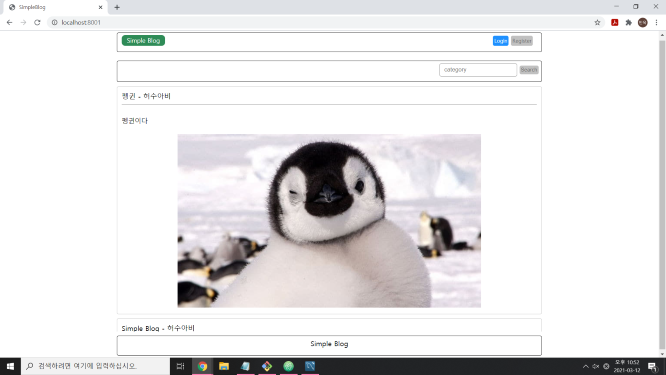
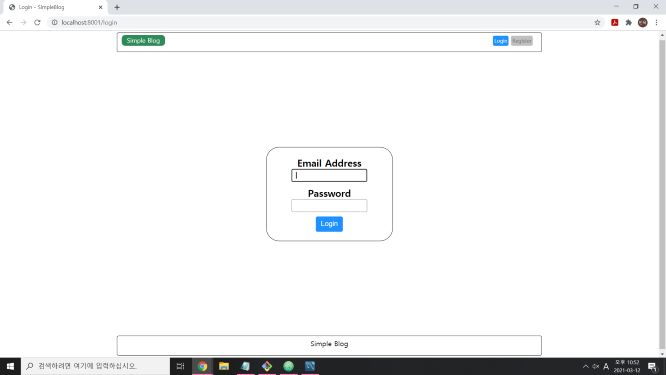
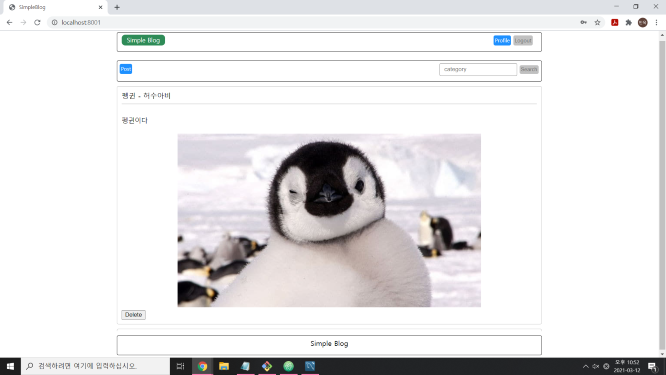
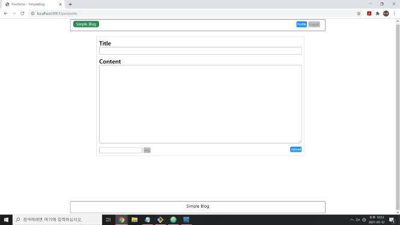

# simpleblog

블로그 만들기 프로젝트의 첫 번째 블로그입니다. 
Node.js와 관계형 DB인 MySQL로 제작하였습니다.

기본적인 게시판 형식으로 로그인, 게시글 작성 그리고 카테고리 검색 기능 등이 있으며, 
로그인 시 권한을 부여하여 본인이 작성한 게시물에 영향을 줄 수 있습니다.

---

### Main
메인 화면입니다. 업로드 된 게시물을 스크롤 형식으로 올려서 볼 수 있게 구현하였습니다. 
템플릿 엔진은 html을 유지할 수 있는 nunjucks를 사용하였습니다.

### Login
Passport 모듈로 로컬 로그인을 구현하였습니다. 
Register 페이지에서 회원 가입을 마친 사용자는 로그인을 할 수 있습니다.

### Main(logged in)
로그인이 완료된 상태의 메인 화면 입니다. 내 프로필 보기가 가능하며, 
게시물 쓰기와 본인 게시물의 삭제 권한이 생깁니다.

### Post
글 쓰기 화면입니다. 제목과 내용 부분으로 나누어져 있으며, 
내용 끝에 쉼표(,)를 이용하여 카테고리를 분류할 수 있습니다. 
이후 메인 화면에서 카테고리 검색이 가능합니다. 
또한 Multer 모듈로 이미지 업로드를 구현하였습니다.

---

[Node.js교과서(조현영 저)](https://www.zerocho.com/books)를 보고 공부했습니다.
